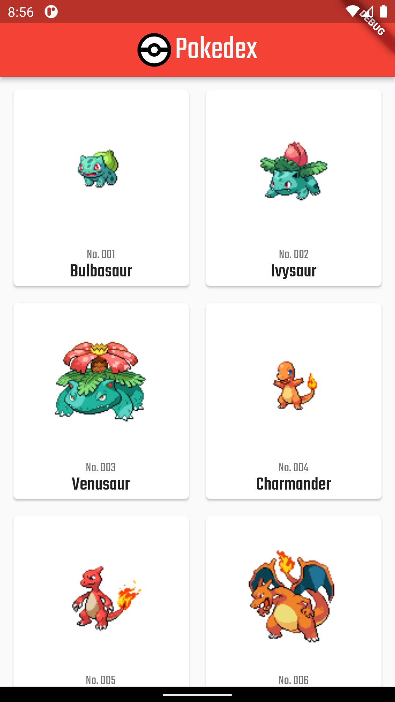

# Flutter Pokedex

Flutter Pokedex with [Pokeapi](https://pokeapi.co/) and [flutter_bloc](https://bloclibrary.dev/#/)

## App preview

## Installation
- Add [Flutter](https://flutter.dev/docs/get-started/install) to your machine
- Open this project folder with Terminal/CMD and run `flutter packages get`
- To run the project run `flutter run` and select the emulator, to run flutter web run `flutter run -d chrome --web-renderer canvaskit`

